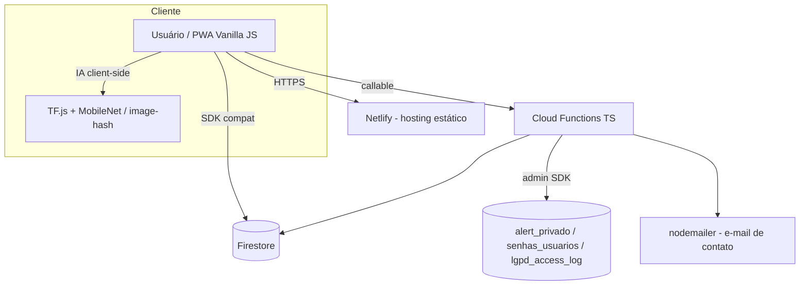
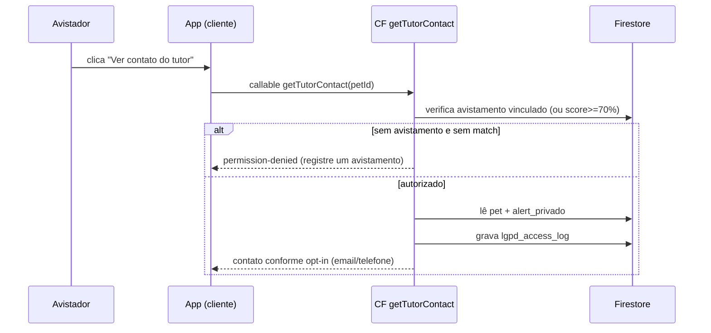

# Manual Técnico — Encontre Pet

Para desenvolvedores e mantenedores. Visão de arquitetura, modelo de dados, segurança, i18n, setup, deploy e custos. Complementa `CLAUDE.md`, `AGENTS.md` e `AUDIT.md`.

---

## 1. Arquitetura geral



- **Front:** Vanilla JS, sem bundler. Scripts carregados em ordem em `index.html` (locales → i18n → config → security → auth → serviços de imagem → ai → db → app).
- **Dados:** Firestore (cliente via SDK compat) + Cloud Functions para operações sensíveis.
- **IA:** roda **no dispositivo** (privacidade + custo zero de servidor). Modelo carregado sob demanda por `AIVision.loadModel()`.
- **Hospedagem:** Netlify (banda maior que Firebase Hosting). Functions e Firestore no projeto `encontre-pet-137d2`.

## 2. Modelo de dados Firestore + matriz de acesso

| Coleção | Leitura pública | Leitura autenticado | Escrita | Notas |
|---|---|---|---|---|
| `pets_perdidos` | ✅ Todos | ✅ Todos | Só dono / admin | **Sem** e-mail/tel privados; só `*_publico` opt-in |
| `avistamentos` | ✅ Todos | ✅ Todos | Só dono / admin | Contato só se `telefone_publico_ativo` |
| `alert_privado` | ❌ | ✅ Só dono | Só dono | Não-donos: via Cloud Function. `get` por dono, `list:false` |
| `sighter_authorizations` | ❌ | Avistador ou dono do pet | Só create (imutável) | ID `{sighterFirebaseUid}_{petId}` |
| `usuarios` | ❌ | Próprio uid / e-mail / admin | Próprio / admin | `list` limitado a 200 p/ não-admin; `role`/`status` protegidos |
| `notificacoes` | ❌ | Só destinatário | Create por autenticado | Requer `destinatario_uid`/`destinatario_firebase_uid` |
| `conversas` + `mensagens` | ❌ | Só participantes | CF cria; participante envia msg (≤1000 chars) | `conversaId = {petId}_{avistamentoId}` |
| `lgpd_access_log` | ❌ | ❌ | Só create (cliente) / admin SDK | Log de auditoria |
| `senhas_usuarios` | ❌ | ❌ | ❌ (só admin SDK) | `senha_hash` isolado (S-03) |
| `admin_roles` | ❌ | Só o próprio admin (`get`) | ❌ cliente | Criado manualmente no Console |

Doc público de pet (resumo dos campos relevantes): identificação, foto comprimida, `foto_hash`, localização **pública/ofuscada**, `telefone_publico`/`telefone_publico_ativo`, `contato_email_publico`/`email_publico_ativo`, `owner_uid` (`u_xxx`) e `owner_firebase_uid` (ver S-08), `status`, `raio_busca_km`. Dados sensíveis (telefone/e-mail completos, endereço e lat/long reais) ficam em `alert_privado`.

## 3. Fluxo de revelação de contato (pós-correções)



- **Dono** lê seus próprios dados direto de `alert_privado` (rule `get` por dono).
- **Não-dono** só acessa via CF, sempre com **log LGPD** e respeitando `email_publico_ativo`/telefone público.
- Não existe mais fallback de leitura direta para não-donos (S-01/S-04 corrigidos).

## 4. Pipeline de matching client-side

1. Avistamento gera foto → **compressão** (`image-utils.js`) e **hash de imagem** (`services/image-hash.js`).
2. `ai-match.js` calcula score combinando: similaridade visual (TF.js/MobileNet via `ai-vision.js`) e/ou distância de hash, com **gate por distância geográfica** e cor/espécie.
3. **Threshold único: 70%** (`app-config.js` `MATCH_THRESHOLD`). Acima disso, vira candidato/notificação de match. Fallback de engine com timeout.
4. A CF `onAvistamentoCreate` reage ao novo avistamento: registra log, notifica os dois lados em match alto e cria a `conversa`.

## 5. Sistema de identidade dupla (`u_xxx` + Firebase UID)

- O app gera um ID customizado **`u_xxx`** (`owner_uid`) e também usa o **Firebase Auth UID** (`owner_firebase_uid`).
- **Toda verificação de ownership aceita os dois**, no cliente e nas rules (`owner_uid == request.auth.uid || owner_firebase_uid == request.auth.uid`).
- ⚠️ **Atenção:** como `u_xxx` ≠ Firebase UID, na prática só `owner_firebase_uid` casa com `request.auth.uid` nas rules. Por isso o **S-08** (remover `owner_firebase_uid` dos docs públicos) **não pode ser feito sem antes reescrever e testar as rules** — senão o dono perde acesso de escrita. Ver `scripts/migrate-s08-owner-firebase-uid.js`.

## 6. i18n (PT/EN/ES)

- Locales em `js/i18n/locales/{pt,en,es}.js`; motor em `js/i18n.js` (`I18n.t('chave', { param })`).
- Interpolação por `{param}` (ex.: `details.whatsapp_msg`, `match.notify_high`).
- Thresholds/raios são injetados nos locales a partir de `AppConfig` (`*_RADIUS`, `*_MATCH_THRESHOLD`) — **não duplicar números**.
- **Adicionar chave nova:** inserir nas **três** línguas, mantendo paridade. Toda string visível ao usuário precisa de chave.

## 7. Setup local

```bash
# Front (estático)
netlify dev                      # http://localhost:8888 (já no CORS das functions)
# ou
firebase emulators:start --only hosting

# Functions
npm --prefix functions install
npm --prefix functions run build

# Emulador de regras (para testes de segurança)
firebase emulators:start --only firestore
```

## 8. Deploy

```bash
firebase deploy --only firestore:rules     # regras (após testes no emulator!)
npm run deploy:functions                    # = firebase deploy --only functions
# Front: deploy via Netlify (push na branch conectada)
```

## 9. Monitoramento de custos Blaze e orçamento

- Acompanhar no Console Firebase: **leituras/escritas/excluções** do Firestore e **invocações** de Functions por dia.
- Configurar **alerta de orçamento** no Google Cloud Billing (ex.: alerta em valor simbólico para detectar anomalia cedo).
- Princípios para manter custo zero: cache TTL, `get()` em vez de `onSnapshot` onde tempo real não é essencial, paginação com cursor, consolidar campos lidos juntos. Ver `PLANO_FASE2.md`.

## 10. Processo de auditoria de segurança (S-XX)

- `AUDIT.md` é a **referência canônica**. Cada achado recebe ID `S-XX`, severidade, arquivo+linha e correção.
- Ao encontrar um novo problema: registrar em `AUDIT.md` (Índice + Achado detalhado + checklist) e atualizar o **Histórico de Auditorias**.
- Correção: **um commit por achado** (`fix(security): S-XX — <título>`), com testes do Rules emulator quando tocar regras (gabarito = "Matriz de Acesso Esperada").

## 11. Checklist LGPD

- [ ] Dado sensível novo vai para `alert_privado` (nunca em doc público).
- [ ] Acesso de não-dono a contato passa por CF e gera `lgpd_access_log`.
- [ ] Opt-in respeitado (`telefone_publico_ativo`, `email_publico_ativo`).
- [ ] Localização sempre ofuscada para terceiros.
- [ ] Senhas só em `senhas_usuarios` (nunca no doc público de usuário).
- [ ] Eventos relevantes logados (`contato_*`, `match_alto`, `pet_encontrado`, `exclusao_dados`).
- [ ] Caminho de **exclusão de dados** do usuário previsto e registrado.

---

*Mantenha este documento sincronizado com o app real (Regra de Ouro): verifique o código antes de documentar.*
